# How do I recreate my Excel report with InetSoft's tool?

This document contains instructions on how to recreate your Excel report using InetSoft's Style Intelligence. It covers the most common usage needs for table style reports.

[How do I combine multiple pivot tables into one table?](#pivot)

[How do I include multiple lists in the same table?](#lists)

[How do I group table columns under subheaders??](#sub)

# How do I combine multiple pivot tables into one table? 

This multilevel freehand table example uses the Orders Details dataset. We will be creating a table that combines pivot tables displaying orders by month broken down by team and salesperson, product category and product, and company.

Begin by dragging out a freehand table element and selecting 'Edit'.

Then right click on a cell and click 'Insert Row'. 

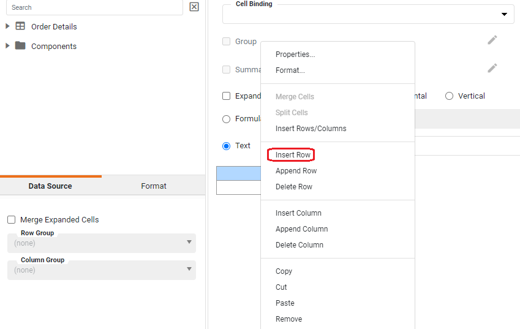

Right click on a cell again and select 'Insert Rows/Columns'.

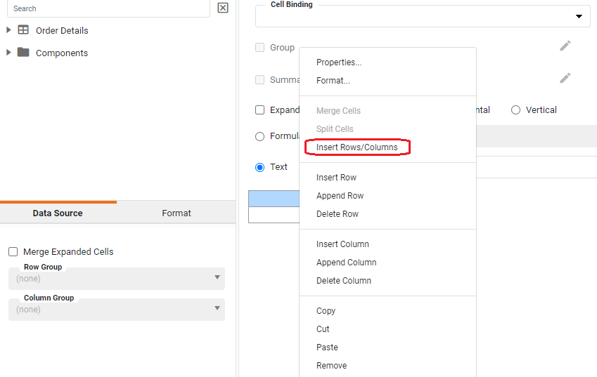

Insert 3 extra columns, after the selection.

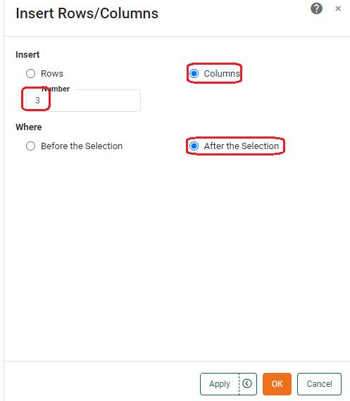

Drag out dimension 'Order Date' into the bottom left cell. 

Select the cell containing order date, and set group to the month level. Set 'expand cell' to Vertical.

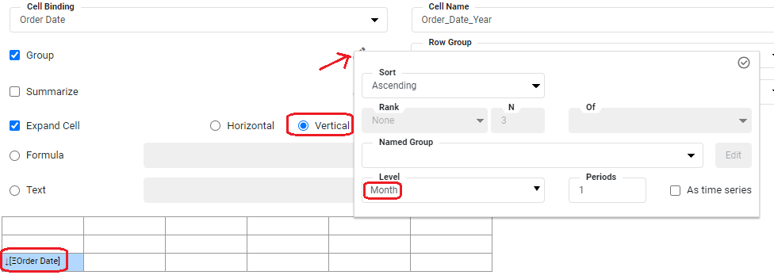

Add dimensions Sales Team' and 'Sales Rep' to the cells where they are pictured below.

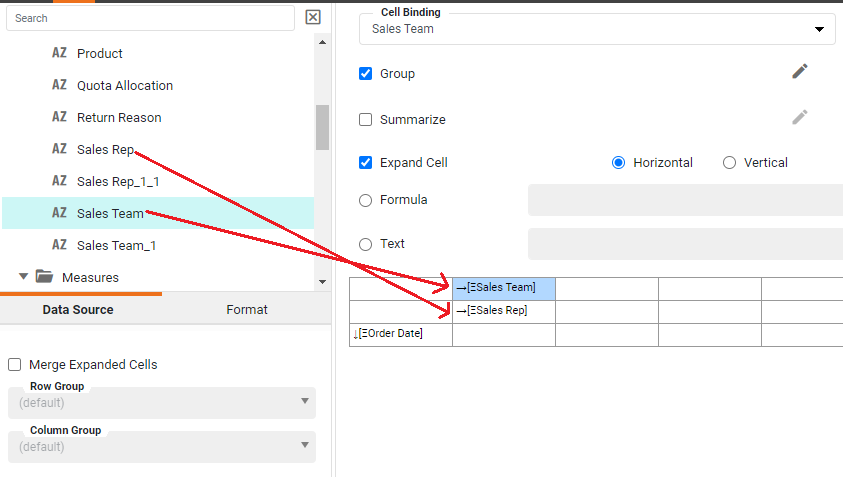

Make sure that on 'Sales Team', and 'Sales Rep', expand is set to Horizontal.

Add 'Gross Amount' to the bottom cell of the second column.

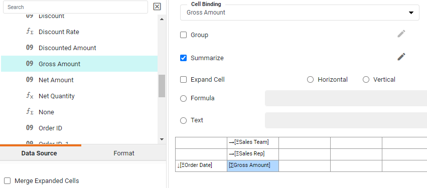

Next, move dimensions 'Category' and 'Product' into the first two cells of the third column. Make sure expand on both is set to Horizontal.

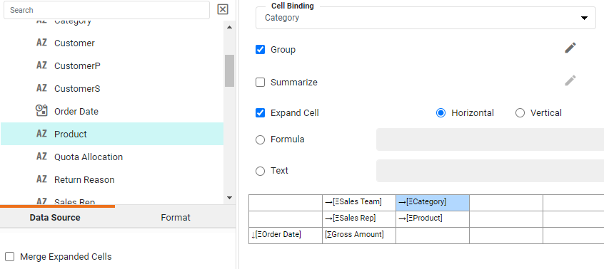

Drag 'Gross Amount' into the bottom cell of the third column.

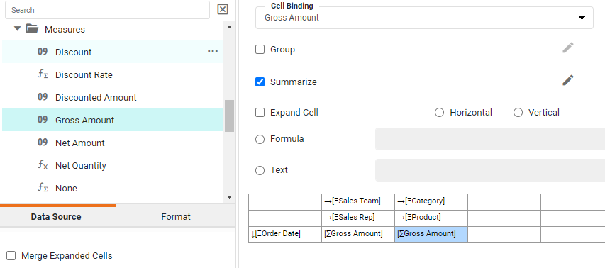

Select the top two blank cells on the right. Right click  and select 'Merge Cells'.

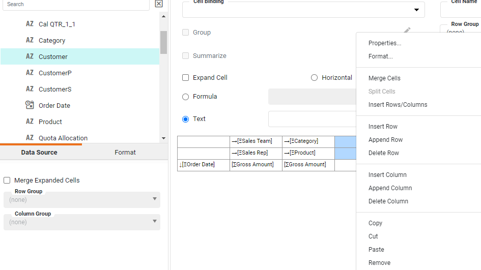

Drag 'Customer' dimension into the merged cells. Make sure it is set on Horizontal.

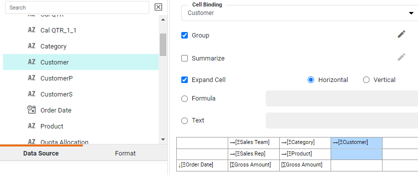

Drag 'Gross Amount' measure into the bottom right cell.

Click 'Finish'. You now have a freehand table which combines three pivot tables into one.

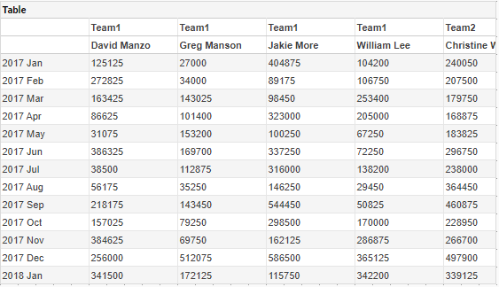 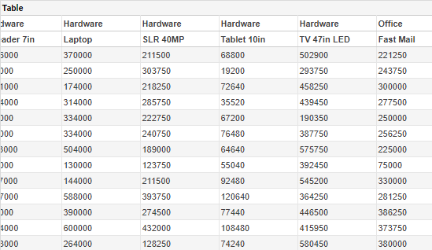 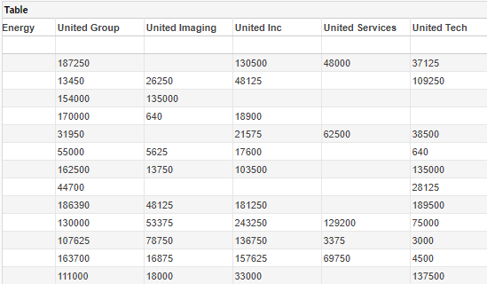
