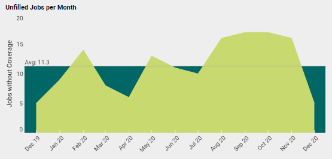

This document contains instructions on how to perform the most common date comparisons with InetSoft's tool.

# Most Common Date Comparisons
[How do I compare this past week to the same week last year?](#week)

[How do I compare this past month to the same month last year?](#month)

[How do I compare two nonconsecutive months?](#nonconsecutive)

## How do I compare this past week to the same week last year? 

Right click on the chart to see a menu of options, click on 'Date Comparison'

   

## How do I compare this past month to the same month last year? 

   

## How do I compare two nonconsecutive months?

