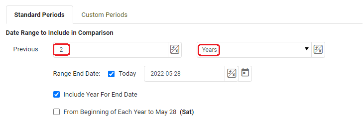

This document contains instructions on how to perform the most common date comparisons with InetSoft's tool.

# Most Common Date Comparisons
[How do I compare this past week to the same week last year?](#week)

[How do I compare two nonconsecutive months from the same year?](#nonconsecutive)

# How do I compare this past week to the same week last year? 
[Instructions](#inst1)

[When starting with a previous week](#prev1)

[When comparing this past month to the same month last year](#month)

[When starting from the middle of a month](#middle2)

[When comparing periods of multiple months](#multiple2)

[When starting from the middle of a week](#middle1)

[When comparing periods of multiple weeks](#multiple1)

### Instructions
Right click on the chart to see a menu of options, click on 'Date Comparison'.

 
Make sure you are on the 'Standard Periods' tab.  Enter '2' in 'Previous' and select 'Years' in the dropdown menu. Check box for 'Today' and 'Include Year For End Date'. Uncheck the box for 'From Beginning of Each Year To...'

 

Select 'Same Week' under 'Compare Data of',  'Year' in 'For Each', and 'Week' under 'Granularity'. Check box for 'Use Range End Date'. Click 'Ok'.

 
The chart should change to show only the two data points, one for the most recent week, and one for the same week last year.

## How do I compare a previous week to the same week last year?

Perform the steps above, except where it says 'Range End Date' uncheck the box for 'Today' and instead manually enter the last day of the week you want to compare with the same week last year.

## How do I compare this past month to the same month last year? 
Select 'Same Month' under 'Compare Data of',  'Year' in 'For Each', and 'Month' under 'Granularity'. Check box for 'Use Range End Date'. Click 'Ok'.
##  How do I compare a previous month to the same month last year?
Perform the steps above, except where it says 'Range End Date' uncheck the box for 'Today' and instead manually enter the last day of the month you want to compare with the same month last year.
##  How do I compare the past thirty days starting in the middle of the month to the same thirty days last year?
Use the  [Custom Periods](#arb) tab and enter the start and end dates of both thirty day periods.
## How do I compare the past two or three months with the same months last year?
Use the  [Custom Periods](#arb) tab and enter the start and end dates of the periods you want to compare.

## How do I compare the past seven days starting in the middle of the week to the same period last year?
Use the  [Custom Periods](#arb) tab and enter date ranges of the seven day periods you want to compare.
## How do I compare the past two or three weeks with the same period last year?
Use the  [Custom Periods](#arb) tab and enter the start and end date of the periods you want to compare.

   

[Instructions](#inst2)

[When starting with a previous month](#prev2)

   

# How do I compare two nonconsecutive months from the same year?

[Instructions](#inst3)

[Adding additional months for comparison](#add)

[Using Custom Periods](#arb)

## Instructions
Right click on the chart to see a menu of options, click on 'Date Comparison'.

 
If you want to compare two nonconsecutive months, such as March and May, of the same year or different years, click the 'Custom Periods' tab on the top right of the Date Comparison menu. When in the 'Custom Periods' tab, enter the start and end dates of the months you want to compare and click 'OK'.

The chart should change to show only the two data points, one for each month you entered the date ranges of.

##  How do I compare three or more months?
You may compare as many periods as you like in the 'Custom Periods' tab, click the + button underneath the visible date ranges to add more periods.

## Comparing Custom Periods
In addition to comparing nonconsecutive months, the Custom Periods tab can also be used for other comparisons of arbitrary periods, such as comparing the past 7 days starting in the middle of the week, the past 30 days starting in the middle of a month, or comparing clusters of multiple weeks or months. Follow the directions above but enter date ranges that address your query.

