Date comparion allows a designer or end user to compare measures(numeric values) for two or more date ranges. This document demonstrates the most common use cases. A live [online example](https://www.inetsoft.com/public/app/viewer/view/global/Dashboards/Date%20Comparison) is provided that you can play along with.

For charts and crosstabs with a date dimension, Date Comparsion becomes available on the component's built-in menu. In the example,
right click on the chart to see a menu of options, click on 'Date Comparison'

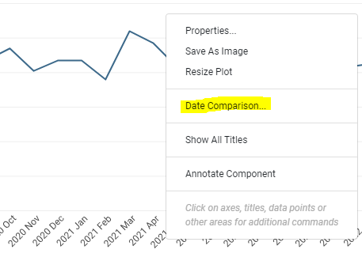
 
Clicking 'Date Comparison' will bring up the Date Comparison dialog box.

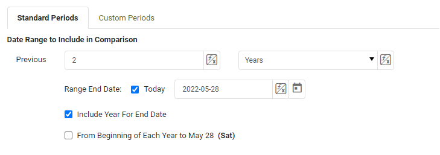

# Most Common Date Comparisons
[How do I compare this past week to the same week last year?](#week)

[How do I compare this past week to the previous week?](#previous)

[How do I calculate percent change year over year in a table?](#table)

[How do I compare two arbitrary periods?](#nonconsecutive)

# How do I compare the most recent week to the same week last year? 
[Instructions](#inst1)

[When starting with this week](#prev1)

[When comparing this past month to the same month last year](#month)

[When starting from the middle of a month](#middle2)

[When starting with a previous month](#prev2)

[When comparing periods of multiple months](#multiple2)

[When starting from the middle of a week](#middle1)

[When comparing periods of multiple weeks](#multiple1)

### Instructions

The example is performed using the dashboard linked [here](https://www.inetsoft.com/public/app/viewer/view/global/Dashboards/Date%20Comparison)

Make sure you are on the 'Standard Periods' tab.  In the first two dropdown menus, the type and number of date periods included are selected. For this example, enter '2' In 'Previous', and select 'Years' in the second dropdown menu. Uncheck box for 'Today' since the dataset does not cover today's date. Instead, enter the range end date for the data. In this example, the range end date is 2022-5-28 . Check the box for 'Include Year For End Date'. Uncheck 'From Beginning of Each Year To...' since we want to compare the full previous year.

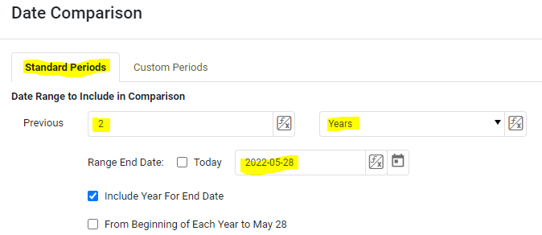

 

The next dropdowns cover which periods are being compared and in what units of time. Select 'Same Week' under 'Compare Data of',  'Year' in 'For Each', and 'Week' under 'Granularity'. Check box for 'Use Range End Date'. Click 'Ok'.

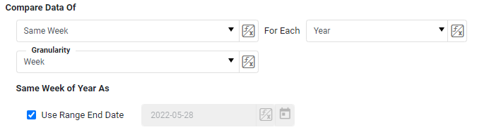
 
The chart should change to show only the two data points, one for the most recent week, and one for the same week last year.

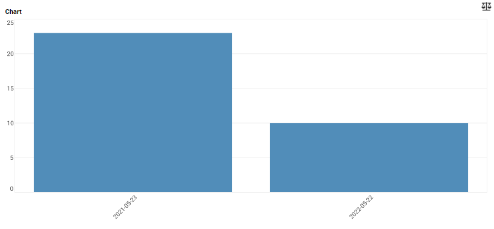

## How do I compare this current week to the same week last year?

Perform the steps above, except where it says 'Range End Date' check the box for 'Today' .

## How do I compare this past month to the same month last year? 
Select 'Same Month' under 'Compare Data of',  'Year' in 'For Each', and 'Month' under 'Granularity'. Check box for 'Use Range End Date'. Click 'Ok'.
##  How do I compare a previous month to the same month last year?
Perform the steps above, except where it says 'Range End Date' uncheck the box for 'Today' and instead manually enter the last day of the month you want to compare with the same month last year.
How To             |  Result
:-------------------------:|:-------------------------:
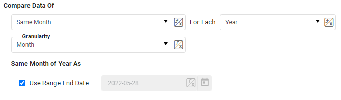  |  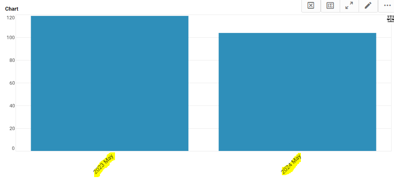
##  How do I compare the past thirty days starting in the middle of the month to the same thirty days last year?
Use the  [Custom Periods](#arb) tab and enter the start and end dates of both thirty day periods.
How To             |  Result
:-------------------------:|:-------------------------:
  |  
## How do I compare the past two or three months with the same months last year?
Use the  [Custom Periods](#arb) tab and enter the start and end dates of the periods you want to compare.

## How do I compare the past seven days starting in the middle of the week to the same period last year?
Use the  [Custom Periods](#arb) tab and enter date ranges of the seven day periods you want to compare.
## How do I compare the past two or three weeks with the same period last year?
Use the  [Custom Periods](#arb) tab and enter the start and end date of the periods you want to compare.

   

# How do I compare this past week to previous week? 
[Instructions](#inst2)

[When comparing a current month to previous month](#prev3)

[When comparing seven day periods starting in the middle of the week](#rolling)

### Instructions

The example is performed using the dashboard linked [here](https://www.inetsoft.com/public/app/viewer/view/global/Dashboards/Date%20Comparison)

Right click on the chart to see a menu of options, click on 'Date Comparison'.

 
Make sure you are on the 'Standard Periods' tab.  Enter '1' in 'Previous' and select 'Weeks' in the dropdown menu. Check box for 'Today' and 'Include Week For End Date'. Uncheck the box for 'From Beginning of Each Week To...'

 

Select 'All' under 'Compare Data of', and 'Week' under 'Granularity'. Click 'Ok'.

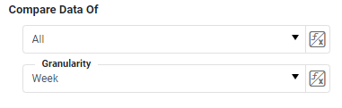
 
The chart should change to show only the two data points, one for the most recent week, and one for the same week last year.

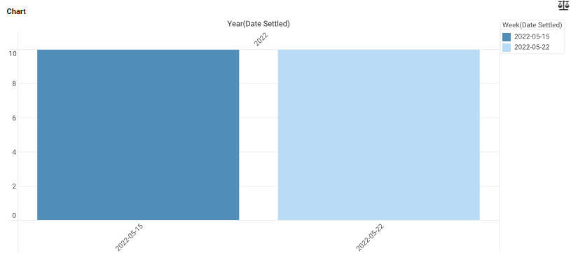

### How do I compare this past month to the previous month?

Follow the instructions above, except select 'Months" instead of 'Weeks' in both dropdowns.

### How do I compare the past two seven day periods, starting in the middle of the week?

Use the  [Custom Periods](#arb) tab and enter the start and end date of the periods you want to compare.

# How do I calculate percent change year over year in a table? 

[Instructions](#taleinst)

[When comparing this past month to the same month last year](#month2)

[When starting from the middle of a month](#middle3)

[When starting with a previous month](#prev4)

[When comparing periods of multiple months](#multiple3)

[When starting from the middle of a week](#middle4)

[When comparing periods of multiple weeks](#multiple4)

## Instructions

This example will use the crosstab table in the product return dashboard found in the InetSoft gallery

[here](https://www.inetsoft.com/evaluate/bi_visualization_gallery/dashboard.jsp?dbIdx=9)

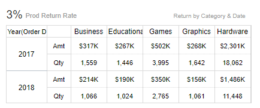

Click on the ... button on the top right corner of the table to access menu options. Click 'Date Comparison'.

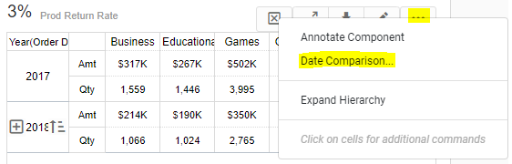

Make sure you are on the 'Standard Periods' tab.  Enter '2' in 'Previous' and select 'Years' in the dropdown menu. Check box for 'Today' and 'Include Year For End Date'. Uncheck the box for 'From Beginning of Each Year To...'

Select 'All' under 'Compare Data of', and 'Year' under 'Granularity'. Select '%Change & Value'. Click 'Ok'.
screenshots/table-percent-change-and-value.PNG

The table should update with the most recent year displaying the original aggregates plus the percent change from the previous year.

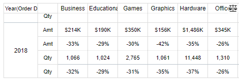

## How do I compare this past month to the same month last year? 
Select 'Same Month' under 'Compare Data of',  'Year' in 'For Each', and 'Month' under 'Granularity'. Check box for 'Use Range End Date'. Click 'Ok'.
##  How do I compare a previous month to the same month last year?
Perform the steps above, except where it says 'Range End Date' uncheck the box for 'Today' and instead manually enter the last day of the month you want to compare with the same month last year.
##  How do I compare the past thirty days starting in the middle of the month to the same thirty days last year?
Use the  [Custom Periods](#arb) tab and enter the start and end dates of both thirty day periods.
## How do I compare the past two or three months with the same months last year?
Use the  [Custom Periods](#arb) tab and enter the start and end dates of the periods you want to compare.

## How do I compare the past seven days starting in the middle of the week to the same period last year?
Use the  [Custom Periods](#arb) tab and enter date ranges of the seven day periods you want to compare.
## How do I compare the past two or three weeks with the same period last year?
Use the  [Custom Periods](#arb) tab and enter the start and end date of the periods you want to compare.

# How do I compare two arbitrary periods?

[Comparing Arbitrary Periods](#arb)

[Instructions](#inst3)

[Adding additional periods for comparison](#add)

## Comparing Arbitrary Periods with the Custom Periods Tab
In addition to comparing nonconsecutive months, the Custom Periods tab can also be used for other comparisons of arbitrary periods, such as comparing the past 7 days starting in the middle of the week, the past 30 days starting in the middle of a month, or comparing clusters of multiple weeks or months. Follow the directions below but enter date ranges that address your query.

## Instructions
This example will show how to compare two nonconsecutive months from the same year. Right click on the chart to see a menu of options, click on 'Date Comparison'.

 
If you want to compare two nonconsecutive months, such as March and May, of the same year or different years, click the 'Custom Periods' tab on the top right of the Date Comparison menu. When in the 'Custom Periods' tab, enter the start and end dates of the months you want to compare and click 'OK'.

The chart should change to show only the two data points, one for each month you entered the date ranges of.

##  How do I compare three or more months?
You may compare as many periods as you like in the 'Custom Periods' tab, click the + button underneath the visible date ranges to add more periods.

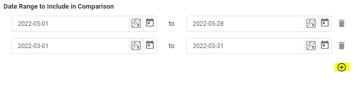

