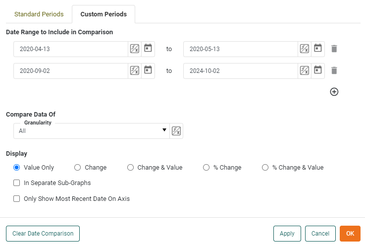
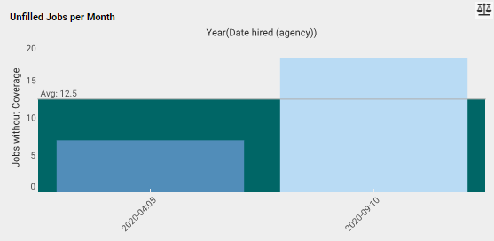

# Comparing Custom Periods

Custom periods are defined as any nonstandard period such as starting from the middle of a week or month while comparing those periods.

For this example of comparing dates on custom periods, we will use a chart displaying the number of unfilled jobs per month at a temp agency, with an average of all months already provided.

Let's say that we are a temp agency executive wanting to measure the effectiveness of a particular manager by comparing the number of filled jobs during the managers time at the agency vs. the time without her. The period of time the employee was with the agency is an example of a custom date period since it is not a standard amount such as a week, month, quarter, etc. Also, the period will be compared with a period of completely different length. This is an example of when entering custom date periods is necessary.

Right click on the chart, and click 'Date Comparison'. Select the tab 'Custom Periods'

The 'Standard Periods' tab has options to cover most date comparison use cases, however sometimes it is necessary to manually set the comparison periods. In this example, we will be comparing two month long periods that start and end on different days of the month. Enter the start date and end date of the comparison periods (you may enter as many as you like) and select granularity. In this instance, we will be selecting "All" to compare the totals of both custom periods. Press 'Ok'.

As you can see, the chart has updated to display both custom periods as blocks of distinct colors, for easy comparison.
