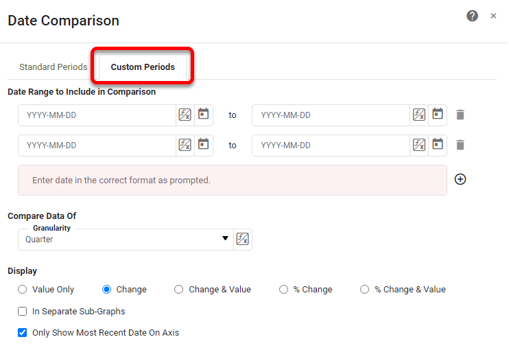

# How to use the Date Comparison Feature

InetSoft’s tool provides a way for users to compare data across various ranges, such as comparing specific months, days, and years.

 To use the date comparison feature, click the … icon at the top right of a chart or table, or right click anywhere if you are dealing with a chart.
 

You can stay on the ‘standard periods’ tab if you are comparing years, quarters, months, weeks, or days.

Select the number of previous periods you want to compare, and the type of period. Select an end date for the comparison range. 

You can also select the ‘custom periods’ tab.

This menu allows you to select the start and end date of each comparison period, and select the unit of time (day, week, month, quarter, year) that you want to compare by. 
